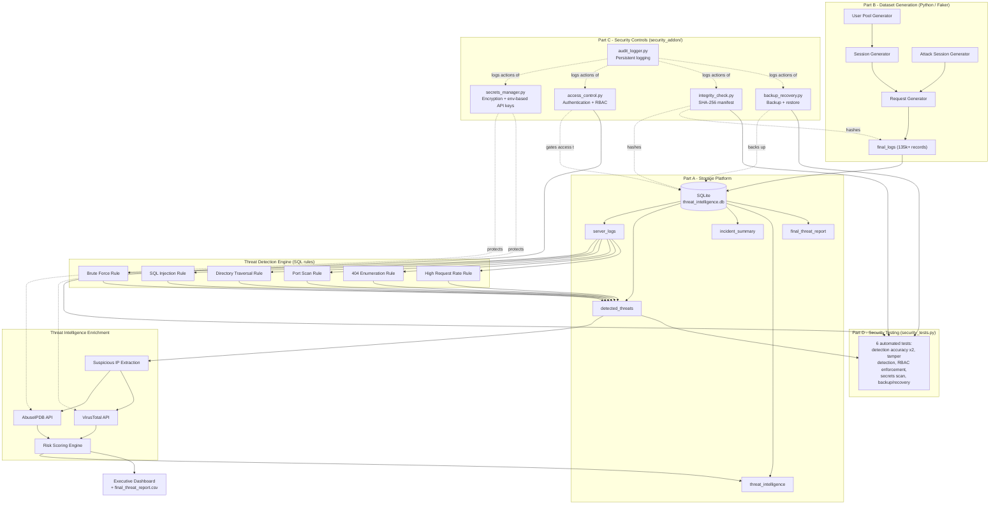

# System Architecture

See the interactive diagram artifact for the polished version. Text/mermaid
version below for the written report and appendices.

## Component Summary

| Layer | Component | Tool/Tech |
|---|---|---|
| Data source | Synthetic web server logs | Python, Faker, NumPy |
| Storage | Relational store | SQLite 3 |
| Detection | Rule-based engine | SQL queries over `server_logs` |
| Threat intel | External enrichment | AbuseIPDB API, VirusTotal API |
| Security - Encryption | Secrets/data at rest | `cryptography.Fernet`, PBKDF2 |
| Security - AuthN/RBAC | Access control | `bcrypt`, JSON-backed role store |
| Security - Integrity | Tamper detection | SHA-256 manifest |
| Security - Logging | Audit trail | Python `logging`, rotating file handler |
| Security - Backup | Disaster recovery | Timestamped SQLite file copies |
| Testing | Automated test suite | Custom `security_tests.py` |
