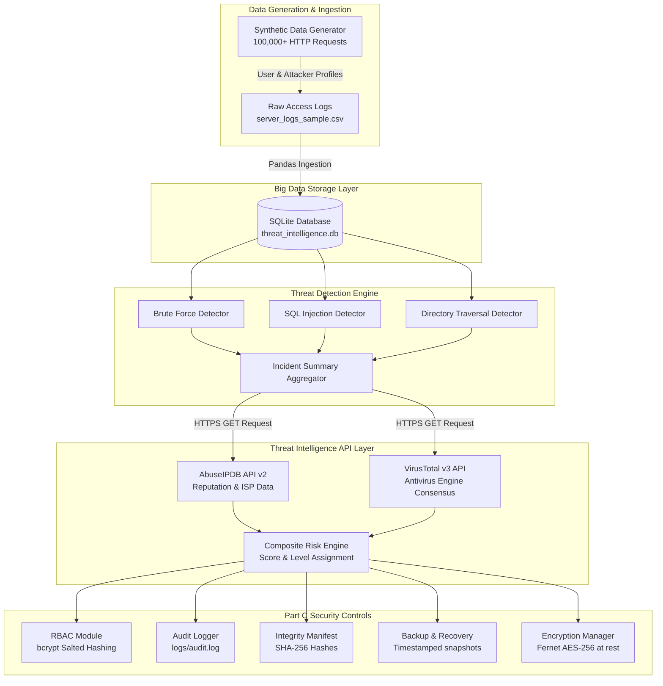

# Deliverable 2: System Architecture Diagram & Technical Specifications

**Project Title**: Threat Intelligence Investigation and Big Data Security Hardening  
**Course**: DSA 4030 - Big Data Security (Group 13)  

---

## 1. High-Level Architecture Overview

The Threat Intelligence Investigation System processes big data web logs, extracts suspicious indicators, enriches them using external Threat Intelligence APIs, and persists them into a secure data warehouse. Security controls are layered across data ingestion, storage, API communication, authentication, auditing, and backup/recovery.

---

## 2. Component Technical Specifications

| System Layer | Tech Stack / Tool | Function & Implementation Details |
| :--- | :--- | :--- |
| **Data Source** | Python (`pandas`, `random`, `datetime`) | Generates $100,000+$ synthetic HTTP log records with user agents, status codes, IPs, and attack payloads. |
| **Storage Platform** | SQLite (`sqlite3` DB engine) | High-performance relational database storing `server_logs`, `detected_threats`, and `incident_summary` tables. |
| **Detection Engine** | Custom Python Rules | Uses regular expressions and grouping algorithms to detect SQLi, Path Traversal, Brute Force, and Scans. |
| **Threat Intelligence** | AbuseIPDB API & VirusTotal v3 | Fetch live IP abuse confidence scores, country, ISP, and multi-engine antivirus scanner verdicts. |
| **Authentication & RBAC** | Python `bcrypt` + JSON Store | Role-Based Access Control enforcing `analyst` (read-only) vs. `admin` (write/enrichment/export) permissions. |
| **Integrity Control** | Python `hashlib` (SHA-256) | Baseline hash manifest calculation (`manifest.json`) and tamper-verification engine. |
| **Encryption at Rest** | `cryptography` (Fernet AES-256) | Key derivation using PBKDF2-HMAC-SHA256 with 390,000 iterations for database & export encryption. |
| **Logging System** | `logging` (`RotatingFileHandler`) | Persists audit trails with timestamps, severity levels, user session IDs, and event descriptions to `audit.log`. |
| **Backup & Recovery** | Python `shutil` | Automated timestamped database replication (`.bak`) and single-command recovery. |

---

## 3. Data Flow Diagram

1. **Ingestion**: Raw web logs ($100,000+$ rows) ingested from CSV into SQLite `server_logs`.
2. **Analysis**: Python detection engine executes SQL queries against `server_logs`, extracting suspicious IP candidates into `incident_summary`.
3. **Enrichment**: `secrets_manager.py` loads API keys from `.env`; requests are dispatched to AbuseIPDB and VirusTotal over TLS 1.3 HTTPS.
4. **Scoring**: Risk scores ($0 - 100$) and risk levels (Low, Medium, High, Critical) are assigned based on threat count and API abuse scores.
5. **Hardening**: `audit_logger.py` records pipeline steps, `backup_recovery.py` creates `.bak` snapshot, and `integrity_check.py` writes SHA-256 manifest.
