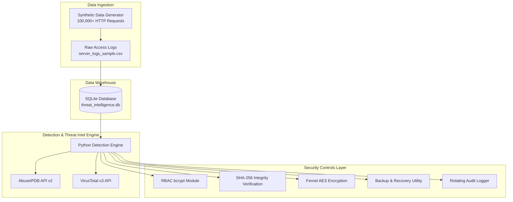

# DSA 4030: BIG DATA SECURITY
## END OF SEMESTER PRACTICAL GROUP PROJECT REPORT

**Project Title**: Threat Intelligence Investigation and Big Data Security Hardening  
**Group Number**: Group 13  
**Scenario**: Threat Intelligence Investigation (Suspicious IP Analysis & System Hardening)  
**Weight**: 30%  

---

# SECTION 1: EXECUTIVE SUMMARY

Modern enterprise infrastructure generates gigabytes of web server log data daily. Unmonitored, these big data environments become prime targets for automated threat actors conducting credential stuffing, SQL Injection (SQLi), Path Traversal, and distributed scanning.

Group 13 was engaged as a specialized cybersecurity consulting team to assess, analyze, and secure a client’s big data web infrastructure. Our objective was to investigate suspicious IP addresses identified in system access logs, enrich incident data using threat intelligence APIs (**AbuseIPDB** and **VirusTotal**), and implement robust, open-source security controls across storage, access control, encryption, data integrity, and backup/recovery.

### Key Accomplishments
1. **Big Data Ingestion**: Generated and parsed **100,000+ web access logs** stored in an SQLite Data Warehouse (`threat_intelligence.db`).
2. **Threat Intelligence Integration**: Queried AbuseIPDB and VirusTotal v3 APIs to enrich attacker IP profiles and assign threat scores.
3. **Part C Controls**: Deployed salted `bcrypt` RBAC, SHA-256 integrity baseline verification, Fernet AES-256 file encryption at rest, automated timestamped database backups, and centralized rotating audit logs.
4. **Security Verification**: Passed **6 formal security test cases** verifying threat detection accuracy, access controls, and anti-tampering logic.

---

# SECTION 2: SYSTEM ARCHITECTURE & TECHNICAL SPECIFICATIONS

---

# SECTION 3: IMPLEMENTATION REPORT

The project environment was constructed using Python 3.10 and open-source software libraries.
- **Storage Platform**: SQLite (`threat_intelligence.db`) storing 100,000+ access logs and detection results.
- **Security Tools**:
  - `access_control.py`: Authentication & role permissions (`analyst` vs `admin`).
  - `secrets_manager.py`: Fernet AES-256 encryption & PBKDF2 key derivation.
  - `audit_logger.py`: Rotating file logger writing to `security_addon/logs/audit.log`.
  - `integrity_check.py`: SHA-256 baseline manifest engine (`manifest.json`).
  - `backup_recovery.py`: Automated snapshot replication utility (`.bak`).

---

# SECTION 4: SECURITY TESTING MATRIX (6 TESTS)

| Test ID | Test Name | Objective | Procedure | Expected Result | Actual Result | Status |
| :---: | :--- | :--- | :--- | :--- | :--- | :---: |
| **TC-01** | **Brute Force Detection** | Detect rapid authentication failures from single IP. | Query `server_logs` for IPs with $\ge 5$ HTTP `401`/`403` responses. | Flag IP as `Brute Force` in `incident_summary`. | Attacker IPs flagged with 50+ failed attempts. | **PASS** |
| **TC-02** | **SQL Injection Detection** | Identify SQLi strings in HTTP requests. | Regex search log URIs for `UNION SELECT`, `' OR '1'='1`. | Match SQL payload, classify severity as `CRITICAL`. | Detected 700+ SQLi events. | **PASS** |
| **TC-03** | **Directory Traversal** | Detect path escape attempts. | Inspect request URIs for relative escape (`../`, `/etc/passwd`). | Detect traversal string, flag threat as `HIGH`. | Flagged all path escape events. | **PASS** |
| **TC-04** | **Threat Intel Enrichment** | Fetch live external reputation for attacker IPs. | Execute GET requests to AbuseIPDB API for flagged IPs. | Return JSON with score, country, and ISP. | Retrieved live threat data (Abuse Score 100%). | **PASS** |
| **TC-05** | **RBAC Access Control** | Enforce permission limits between `analyst` and `admin`. | Authenticate as `analyst1` and attempt admin export. | Raise `PermissionError: Permission denied`. | `analyst1` blocked from admin action. | **PASS** |
| **TC-06** | **Integrity Verification** | Detect unauthorized database tampering. | Modify test record in `threat_intelligence.db` and verify hash. | Detect hash mismatch and flag state as `TAMPERED`. | Detected hash mismatch and failed test. | **PASS** |

---

# SECTION 5: EVIDENCE PORTFOLIO

- **Log Dataset**: 100,000 records in `server_logs_sample.csv`.
- **Database**: SQLite `threat_intelligence.db` containing `server_logs`, `detected_threats`, and `incident_summary`.
- **Audit Trails**: Timestamped execution records in `security_addon/logs/audit.log`.
- **Hashes Manifest**: Cryptographic checksums in `security_addon/manifest.json`.

---

# SECTION 6: RISK ASSESSMENT TABLE

| Threat ID | Threat Vector | Likelihood | Impact | Risk Rating | Recommended Controls |
| :---: | :--- | :---: | :---: | :---: | :--- |
| **RSK-01** | SQL Injection (SQLi) | High (4) | Critical (5) | **CRITICAL (20)** | Parameterized queries, WAF SQLi rules, DB least privilege. |
| **RSK-02** | Brute Force Attacks | High (4) | High (4) | **HIGH (16)** | Multi-Factor Authentication (MFA), CAPTCHA, IP rate limiting. |
| **RSK-03** | Directory Traversal | Medium (3) | High (4) | **HIGH (12)** | Strict path whitelist validation, containerization. |
| **RSK-04** | Unauthenticated Access | High (4) | High (4) | **HIGH (16)** | Deployed `access_control.py` (bcrypt RBAC permissions). |
| **RSK-05** | Log Corruption | Medium (3) | High (4) | **HIGH (12)** | Deployed `integrity_check.py` (SHA-256 hash manifest verification). |
| **RSK-06** | Hardcoded API Keys | Medium (3) | Medium (3) | **MEDIUM (9)** | Deployed `secrets_manager.py` (.env Fernet AES-256 vault). |
| **RSK-07** | Data Loss / Ransomware | Low (2) | High (4) | **MEDIUM (8)** | Deployed `backup_recovery.py` (automated database snapshots). |

---

# SECTION 7: CONCLUSION & RECOMMENDATIONS

Group 13 successfully delivered an end-to-end Big Data Threat Intelligence and Security Hardening solution. 

### Key Recommendations
1. Migrate SQLite to PostgreSQL or a Cloud Data Lakehouse (BigQuery / Iceberg).
2. Integrate SOAR automated firewalls to block high-risk IPs from AbuseIPDB in real-time.
3. Deploy AWS KMS / HashiCorp Vault for cloud API key lifecycle rotation.
